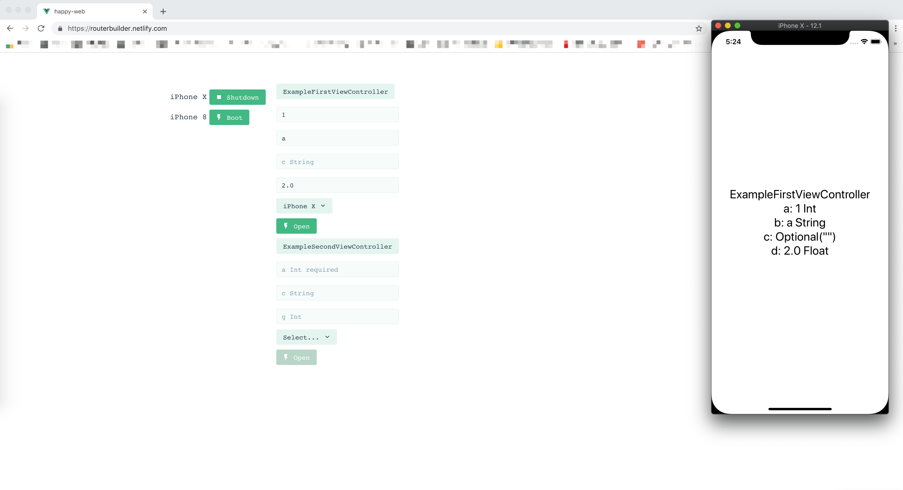
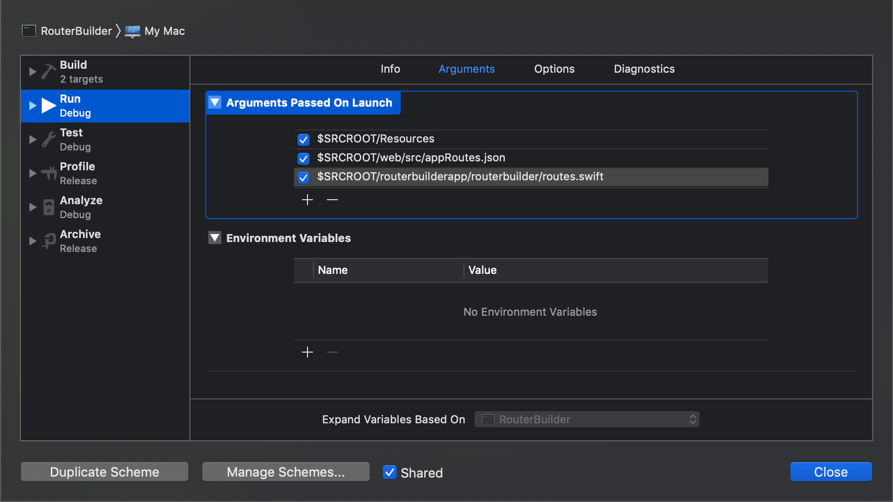

# RouterBuilder



1. 通过 SwiftSyntax 解析 ViewController 的初始化方法，生成可以填写的 Web 表单
2. 本地开启一个 WebSocket，Web 页面和本地的 WebSocket 交互完成页面的跳转展示

> 当然这个 WebSocket 还可以做更多的事情，请自行发挥想象力。这个交互操作灵感来自 vue-cli。

如何运行本工程：

## 准备工作

> 当然这部分可以做成自动的，比如在 Web 页面切换模拟器使用的 App 版本。

### 安装 App 到模拟器（必要操作）

编译运行工程 `routerbuilderapp/routerbuilder.xcodeproj` 到对应的模拟器

### 生成路由信息相关文件

生成 `web/src/appRoutes.json` 和 `routerbuilderapp/routerbuilder/routes.swift`。
这一步有可能会出问题，所以 git 提交中已经带上了两个文件。

建议通过 Xcode 运行。
 
执行 `./generate-xcodeproj.sh` 创建 Xcode 工程文件。

配置启动参数：

```
$SRCROOT/Resources
$SRCROOT/web/src/appRoutes.json
$SRCROOT/routerbuilderapp/routerbuilder/routes.swift
```

如图：


运行生成 `web/src/appRoutes.json` 和 `routerbuilderapp/routerbuilder/routes.swift` 即可。

## 配置运行 Web 工程

Web 相关工程在 `web` 目录下。

### 启动 Apollo（必要）

`yarn apollo:run`

### 启动 Web 页面

`yarn serve` 或者打开 https://routerbuilder.netlify.com/  。